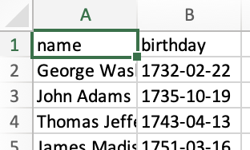
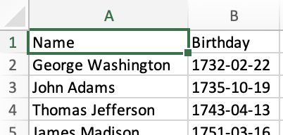

# Tutorial

SheetJS presents a simple JS interface that works with "Array of Arrays" and
"Array of JS Objects".  The API functions are building blocks that should be
combined with other JS APIs to solve problems.

The discussion focuses on the problem solving mindset.  API details are covered
in other parts of the documentation.

The goal of this example is to generate a XLSX workbook of US President names
and birthdays.  [Click here](#live-demo) to jump to the live demo

## Acquire Data

### Raw Data

[The raw data is available in JSON form](https://theunitedstates.io/congress-legislators/executive.json).
For convenience, it has been [mirrored here](https://sheetjs.com/executive.json)

The data result is an Array of objects.  This is the data for John Adams:

```js
{
  "id": { /* (data omitted) */ },
  "name": {
    "first": "John",          // <-- first name
    "last": "Adams"           // <-- last name
  },
  "bio": {
    "birthday": "1735-10-19", // <-- birthday
    "gender": "M"
  },
  "terms": [
    { "type": "viceprez", /* (other fields omitted) */ },
    { "type": "viceprez", /* (other fields omitted) */ },
    { "type": "prez", /* (other fields omitted) */ }
  ]
}
```

### Filtering for Presidents

The dataset includes Aaron Burr, a Vice President who was never President!

`Array#filter` creates a new array with the desired rows.  A President served
at least one term with `type` set to `"prez"`.  To test if a particular row has
at least one `"prez"` term, `Array#some` is another native JS function.  The
complete filter would be:

```js
const prez = raw_data.filter(row => row.terms.some(term => term.type === "prez"));
```

### Reshaping the Array

For this example, the name will be the first name combined with the last name
(`row.name.first + " " + row.name.last`) and the birthday will be the subfield
`row.bio.birthday`.  Using `Array#map`, the dataset can be massaged in one call:

```js
const rows = prez.map(row => ({
  name: row.name.first + " " + row.name.last,
  birthday: row.bio.birthday
}));
```

The result is an array of "simple" objects with no nesting:

```js
[
  { name: "George Washington", birthday: "1732-02-22" },
  { name: "John Adams", birthday: "1735-10-19" },
  // ... one row per President
]
```

## Create a Workbook

With the cleaned dataset, `XLSX.utils.json_to_sheet` generates a worksheet:

```js
const worksheet = XLSX.utils.json_to_sheet(rows);
```

`XLSX.utils.book_new` creates a new workbook and `XLSX.utils.book_append_sheet`
appends a worksheet to the workbook. The new worksheet will be called "Dates":

```js
const workbook = XLSX.utils.book_new();
XLSX.utils.book_append_sheet(workbook, worksheet, "Dates");
```

## Clean up Workbook

The data is in the workbook and can be exported.



There are multiple opportunities for improvement: the headers can be renamed and
the column widths can be adjusted.  [SheetJS Pro](https://sheetjs.com/pro) offers
additional styling options like cell styling and frozen rows.

<details><summary><b>Changing Header Names</b> (click to show)</summary>

By default, `json_to_sheet` creates a worksheet with a header row. In this case,
the headers come from the JS object keys: "name" and "birthday".

The headers are in cells A1 and B1.  `XLSX.utils.sheet_add_aoa` can write text
values to the existing worksheet starting at cell A1:

```js
XLSX.utils.sheet_add_aoa(worksheet, [["Name", "Birthday"]], { origin: "A1" });
```

</details>

<details><summary><b>Changing Column Widths</b> (click to show)</summary>

Some of the names are longer than the default column width.  Column widths are
set by setting the `"!cols"` worksheet property.

The following line sets the width of column A to approximately 10 characters:

```js
worksheet["!cols"] = [ { wch: 10 } ]; // set column A width to 10 characters
```

One `Array#reduce` call over `rows` can calculate the maximum width:

```js
const max_width = rows.reduce((w, r) => Math.max(w, r.name.length), 10);
worksheet["!cols"] = [ { wch: max_width } ];
```

</details>

## Export a File

`XLSX.writeFile` creates a spreadsheet file and tries to write it to the system.
In the browser, it will try to prompt the user to download the file.  In NodeJS,
it will write to the local directory.

:::note

`XLSX.writeFileXLSX` only writes XLSX files and is recommended when the export
will always be in the `.xlsx` format. `writeFileXLSX` is more amenable to tree
shaking.  This example uses `XLSX.writeFile` since `writeFileXLSX` does not
support other common export formats like `.xls` or `.xlsb` or `.csv`.

:::

```js
XLSX.writeFile(workbook, "Presidents.xlsx");
```




## Live Demo

```jsx live
function Presidents() { return ( <button onClick={async () => {
  /* fetch JSON data and parse */
  const url = "https://sheetjs.com/executive.json";
  const raw_data = await (await fetch(url)).json();

  /* filter for the Presidents */
  const prez = raw_data.filter(row => row.terms.some(term => term.type === "prez"));

  /* flatten objects */
  const rows = prez.map(row => ({
    name: row.name.first + " " + row.name.last,
    birthday: row.bio.birthday
  }));

  /* generate worksheet and workbook */
  const worksheet = XLSX.utils.json_to_sheet(rows);
  const workbook = XLSX.utils.book_new();
  XLSX.utils.book_append_sheet(workbook, worksheet, "Dates");

  /* fix headers */
  XLSX.utils.sheet_add_aoa(worksheet, [["Name", "Birthday"]], { origin: "A1" });

  /* calculate column width */
  const max_width = rows.reduce((w, r) => Math.max(w, r.name.length), 10);
  worksheet["!cols"] = [ { wch: max_width } ];

  /* create an XLSX file and try to save to Presidents.xlsx */
  XLSX.writeFile(workbook, "Presidents.xlsx");
}}><b>Click to Generate file!</b></button> ); }
```

## Run the Demo Locally

import Tabs from '@theme/Tabs';
import TabItem from '@theme/TabItem';

<Tabs>
  <TabItem value="browser" label="Browser">

Save the following script to `snippet.html` and open the page.  The page must be
hosted (no `file:///` access).

<https://sheetjs.com/pres.html> is a hosted version of the page.

```html
<body>
<script src="https://cdn.sheetjs.com/xlsx-latest/package/dist/xlsx.full.min.js"></script>
<script>
(async() => {
  /* fetch JSON data and parse */
  const url = "https://sheetjs.com/executive.json";
  const raw_data = await (await fetch(url)).json();

  /* filter for the Presidents */
  const prez = raw_data.filter(row => row.terms.some(term => term.type === "prez"));

  /* flatten objects */
  const rows = prez.map(row => ({
    name: row.name.first + " " + row.name.last,
    birthday: row.bio.birthday
  }));

  /* generate worksheet and workbook */
  const worksheet = XLSX.utils.json_to_sheet(rows);
  const workbook = XLSX.utils.book_new();
  XLSX.utils.book_append_sheet(workbook, worksheet, "Dates");

  /* fix headers */
  XLSX.utils.sheet_add_aoa(worksheet, [["Name", "Birthday"]], { origin: "A1" });

  /* calculate column width */
  const max_width = rows.reduce((w, r) => Math.max(w, r.name.length), 10);
  worksheet["!cols"] = [ { wch: max_width } ];

  /* create an XLSX file and try to save to Presidents.xlsx */
  XLSX.writeFile(workbook, "Presidents.xlsx");
})();
</script>
<body>
```
  </TabItem>
  <TabItem value="nodejs" label="NodeJS">

Install the dependencies:

```bash
npm i --save https://cdn.sheetjs.com/xlsx-latest/xlsx-latest.tgz
```

Save the following script to `snippet.js` and run `node snippet.js`:

```js title="snippet.js"
const XLSX = require("xlsx");

(async() => {
  /* fetch JSON data and parse */
  const url = "https://sheetjs.com/executive.json";
  const raw_data = await (await fetch(url)).json();

  /* filter for the Presidents */
  const prez = raw_data.filter(row => row.terms.some(term => term.type === "prez"));

  /* flatten objects */
  const rows = prez.map(row => ({
    name: row.name.first + " " + row.name.last,
    birthday: row.bio.birthday
  }));

  /* generate worksheet and workbook */
  const worksheet = XLSX.utils.json_to_sheet(rows);
  const workbook = XLSX.utils.book_new();
  XLSX.utils.book_append_sheet(workbook, worksheet, "Dates");

  /* fix headers */
  XLSX.utils.sheet_add_aoa(worksheet, [["Name", "Birthday"]], { origin: "A1" });

  /* calculate column width */
  const max_width = rows.reduce((w, r) => Math.max(w, r.name.length), 10);
  worksheet["!cols"] = [ { wch: max_width } ];

  /* create an XLSX file and try to save to Presidents.xlsx */
  XLSX.writeFile(workbook, "Presidents.xlsx");
})();
```

Native `fetch` support was added in NodeJS 18.  For older versions of NodeJS,
the script will throw an error `fetch is not defined`.  A third-party library
like `axios` presents a similar API for fetching data:

<details><summary><b>Example using axios</b> (click to show)</summary>

Install the dependencies:

```bash
npm i --save https://cdn.sheetjs.com/xlsx-latest/xlsx-latest.tgz
```

The differences in the script are highlighted below.

```js title="snippet.js"
const XLSX = require("xlsx");
// highlight-next-line
const axios = require("axios");

(async() => {
  /* fetch JSON data and parse */
  const url = "https://sheetjs.com/executive.json";
  // highlight-next-line
  const raw_data = (await axios(url, {responseType: "json"})).data;

  /* filter for the Presidents */
  const prez = raw_data.filter(row => row.terms.some(term => term.type === "prez"));

  /* flatten objects */
  const rows = prez.map(row => ({
    name: row.name.first + " " + row.name.last,
    birthday: row.bio.birthday
  }));

  /* generate worksheet and workbook */
  const worksheet = XLSX.utils.json_to_sheet(rows);
  const workbook = XLSX.utils.book_new();
  XLSX.utils.book_append_sheet(workbook, worksheet, "Dates");

  /* fix headers */
  XLSX.utils.sheet_add_aoa(worksheet, [["Name", "Birthday"]], { origin: "A1" });

  /* calculate column width */
  const max_width = rows.reduce((w, r) => Math.max(w, r.name.length), 10);
  worksheet["!cols"] = [ { wch: max_width } ];

  /* create an XLSX file and try to save to Presidents.xlsx */
  XLSX.writeFile(workbook, "Presidents.xlsx");
})();
```

</details>

  </TabItem>
  <TabItem value="deno" label="Deno">

Save the following script to `snippet.ts` and run with
`deno run --allow-net --allow-write snippet.ts`:

```js title="snippet.ts"
// @deno-types="https://cdn.sheetjs.com/xlsx-latest/package/types/index.d.ts"
import * as XLSX from 'https://cdn.sheetjs.com/xlsx-latest/package/xlsx.mjs';

/* fetch JSON data and parse */
const url = "https://sheetjs.com/executive.json";
const raw_data = await (await fetch(url)).json();

/* filter for the Presidents */
const prez = raw_data.filter((row: any) => row.terms.some((term: any) => term.type === "prez"));

/* flatten objects */
const rows = prez.map((row: any) => ({
  name: row.name.first + " " + row.name.last,
  birthday: row.bio.birthday
}));

/* generate worksheet and workbook */
const worksheet = XLSX.utils.json_to_sheet(rows);
const workbook = XLSX.utils.book_new();
XLSX.utils.book_append_sheet(workbook, worksheet, "Dates");

/* fix headers */
XLSX.utils.sheet_add_aoa(worksheet, [["Name", "Birthday"]], { origin: "A1" });

/* calculate column width */
const max_width = rows.reduce((w: number, r: any) => Math.max(w, r.name.length), 10);
worksheet["!cols"] = [ { wch: max_width } ];

/* create an XLSX file and try to save to Presidents.xlsx */
XLSX.writeFile(workbook, "Presidents.xlsx");
```

  </TabItem>
  <TabItem value="bun" label="Bun">

Download <https://cdn.sheetjs.com/xlsx-latest/package/xlsx.mjs> to `xlsx.mjs`

Save the following script to `snippet.js` and run with `bun snippet.js`:

```js title="snippet.js"
import * as XLSX from './xlsx.mjs';
import * as fs from 'fs';
XLSX.set_fs(fs);

/* fetch JSON data and parse */
const url = "https://sheetjs.com/executive.json";
const raw_data = await (await fetch(url)).json();

/* filter for the Presidents */
const prez = raw_data.filter((row) => row.terms.some((term) => term.type === "prez"));

/* flatten objects */
const rows = prez.map((row) => ({
  name: row.name.first + " " + row.name.last,
  birthday: row.bio.birthday
}));

/* generate worksheet and workbook */
const worksheet = XLSX.utils.json_to_sheet(rows);
const workbook = XLSX.utils.book_new();
XLSX.utils.book_append_sheet(workbook, worksheet, "Dates");

/* fix headers */
XLSX.utils.sheet_add_aoa(worksheet, [["Name", "Birthday"]], { origin: "A1" });

/* calculate column width */
const max_width = rows.reduce((w, r) => Math.max(w, r.name.length), 10);
worksheet["!cols"] = [ { wch: max_width } ];

/* create an XLSX file and try to save to Presidents.xlsx */
XLSX.writeFile(workbook, "Presidents.xlsx");
```

  </TabItem>

</Tabs>