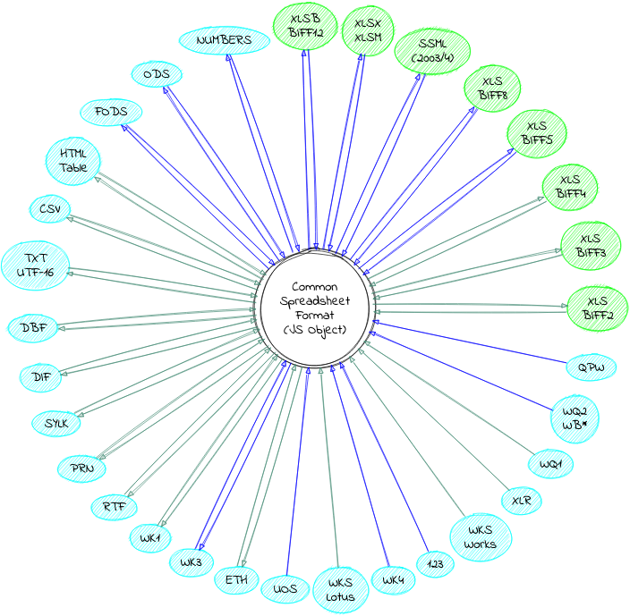
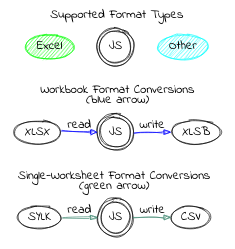

# SheetJS CE


[](https://github.com/SheetJS/sheetjs/actions)
[](https://snyk.io/test/github/SheetJS/sheetjs)
[](https://cdn.sheetjs.com/)

SheetJS Community Edition offers battle-tested open-source solutions for
extracting useful data from almost any complex spreadsheet and generating new
spreadsheets that will work with legacy and modern software alike.

[SheetJS Pro](https://sheetjs.com/pro) offers solutions beyond data processing:
Edit complex templates with ease; let out your inner Picasso with styling; make
custom sheets with images/graphs/PivotTables; evaluate formula expressions and
port calculations to web apps; automate common spreadsheet tasks, and much more!

## Simple Examples

The code editors are live -- feel free to edit!  Due to technical limitations,
they showcase ReactJS patterns.  Other parts of the documentation will cover
more common use cases including plain JavaScript.

### Export an HTML Table to Excel XLSX

<details><summary><b>How to add to your site</b> (click to show)</summary>

1) Make sure your table has an ID:

```html
<table id="TableToExport">
```

2) Include a reference to the SheetJS Library in your page:

```html
<script src="https://cdn.sheetjs.com/xlsx-latest/package/dist/xlsx.full.min.js"></script>
```

3) Add a button that users will click to generate an export

```html
<button id="sheetjsexport"><b>Export as XLSX</b></button>
```

4) Add an event handler for the `click` event to create a workbook and download:

```js
document.getElementById("sheetjsexport").addEventListener('click', function() {
  /* Create worksheet from HTML DOM TABLE */
  var wb = XLSX.utils.table_to_book(document.getElementById("TableToExport"));
  /* Export to file (start a download) */
  XLSX.writeFile(wb, "SheetJSTable.xlsx");
});
```

</details>

<details open><summary><b>Live Example</b> (click to show)</summary>

```jsx live
/* The live editor requires this function wrapper */
function Table2XLSX(props) {

  /* Callback invoked when the button is clicked */
  const xport = React.useCallback(async () => {
      /* Create worksheet from HTML DOM TABLE */
      const table = document.getElementById("Table2XLSX");
      const wb = XLSX.utils.table_to_book(table);

      /* Export to file (start a download) */
      XLSX.writeFile(wb, "SheetJSTable.xlsx");
  });

  return (<>
    <table id="Table2XLSX"><tbody>
      <tr><td colSpan="3">SheetJS Table Export</td></tr>
      <tr><td>Author</td><td>ID</td><td>Note</td></tr>
      <tr><td>SheetJS</td><td>7262</td><td>Hi!</td></tr>
      <tr><td colSpan="3">
        <a href="//sheetjs.com">Powered by SheetJS</a>
      </td></tr>
    </tbody></table>
    <button onClick={xport}><b>Export XLSX!</b></button>
  </>);
}
```

<a href="https://sheetjs.com/pro">SheetJS Pro Basic</a> extends this export with
support for CSS styling and rich text.

</details>

### Download and Preview a Numbers workbook

<details><summary><b>How to add to your site</b> (click to show)</summary>

1) Create a container DIV for the table:

```html
<div id="TableContainer"></div>
```

2) Include a reference to the SheetJS Library in your page:

```html
<script src="https://cdn.sheetjs.com/xlsx-latest/package/dist/xlsx.full.min.js"></script>
```

3) Add a script block to download and update the page:

```html
<script>
(async() => {
  const f = await fetch(URL_TO_DOWNLOAD); // replace with the URL of the file
  const ab = await f.arrayBuffer();

  /* Parse file and get first worksheet */
  const wb = XLSX.read(ab);
  const ws = wb.Sheets[wb.SheetNames[0]];

  /* Generate HTML */
  var output = document.getElementById("TableContainer");
  output.innerHTML = XLSX.utils.sheet_to_html(ws);
})();
</script>
```

</details>

<details><summary><b>Live Example</b> (click to hide)</summary>

```jsx live
/* The live editor requires this function wrapper */
function Numbers2HTML(props) {
  const [html, setHTML] = React.useState("");

  /* Fetch and update HTML */
  React.useEffect(async() => {
    /* Fetch file */
    const f = await fetch("https://sheetjs.com/pres.numbers");
    const ab = await f.arrayBuffer();

    /* Parse file */
    const wb = XLSX.read(ab);
    const ws = wb.Sheets[wb.SheetNames[0]];

    /* Generate HTML */
    setHTML(XLSX.utils.sheet_to_html(ws));
  }, []);

  return (<div dangerouslySetInnerHTML={{__html: html}}/>);
}
```

<a href="https://sheetjs.com/pro">SheetJS Pro Basic</a> extends this import with
support for CSS styling and rich text.

</details>

### Convert a CSV file to HTML Table and Excel XLSX

<details><summary><b>Live Example</b> (click to show)</summary>

```jsx live
/* The live editor requires this function wrapper */
function Tabeller(props) {

  /* Starting CSV data -- change data here */
  const csv = `\
This,is,a,Test
வணக்கம்,สวัสดี,你好,가지마
1,2,3,4`;

  /* Parse CSV into a workbook object */
  const wb = XLSX.read(csv, {type: "string"});

  /* Get the worksheet (default name "Sheet1") */
  const ws = wb.Sheets.Sheet1;

  /* Create HTML table */
  const id = "tabeller"; // HTML TABLE ID
  const __html = XLSX.utils.sheet_to_html(ws, { id });

  return (<>

    {/* Show HTML preview */}
    <div dangerouslySetInnerHTML={{__html}}/>

    {/* Export Button */}
    <button onClick={() => {

      /* Create worksheet from HTML DOM TABLE */
      const table = document.getElementById(id);
      const wb = XLSX.utils.table_to_book(table);

      /* Export to file (start a download) */
      XLSX.writeFile(wb, "SheetJSIntro.xlsx");
    }}>
      <b>Export XLSX!</b>
    </button>

  </>);

}
```

</details>


### Browser Testing

[](https://saucelabs.com/u/sheetjs)

### Supported File Formats




